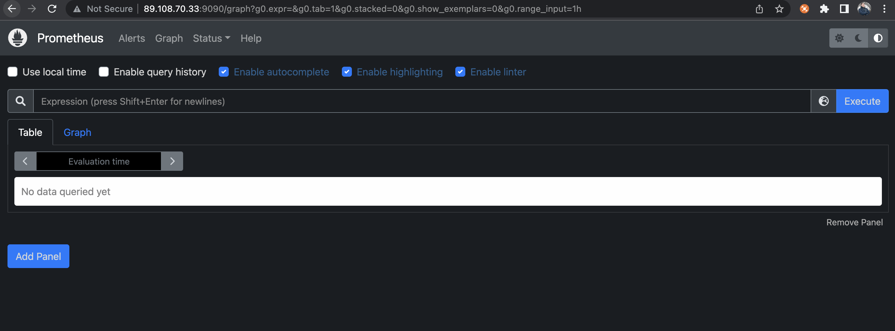
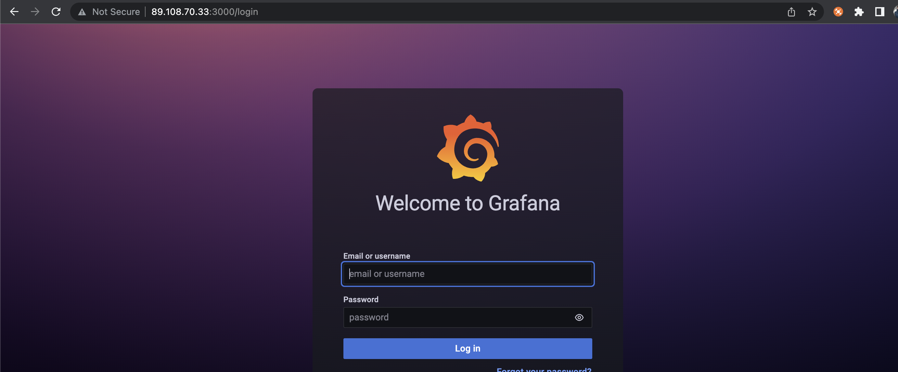
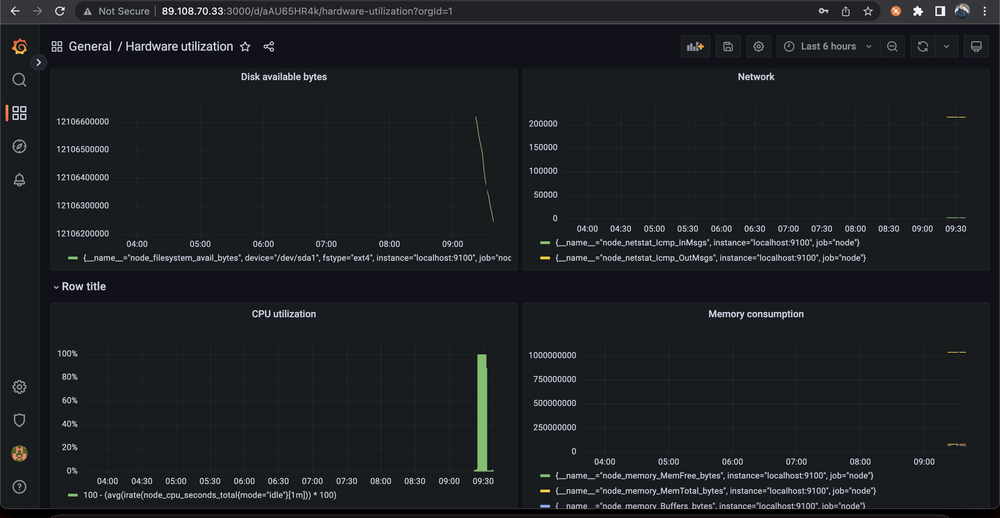

# **Homework 14**
Загрузим и распакуем prometheus
```shell
mkdir -p /tmp/prometheus && cd /tmp/prometheus
curl -s https://api.github.com/repos/prometheus/prometheus/releases/latest \
  | grep browser_download_url \
  | grep linux-amd64 \
  | cut -d '"' -f 4 \
  | wget -qi -
```
```shell
tar xvf prometheus*.tar.gz
cd prometheus*/
```
Запускаем
```shell
./prometheus
```
Проверяем в браузере, видим, что доступна

Также установим и запустим node_exporter + перезапустим prometheus со следующим конфигом:
```yaml
global:
  scrape_interval: 15s

scrape_configs:
- job_name: node
  static_configs:
  - targets: ['localhost:9100']
```
Установим grafana
Добавим репо
```shell
cat <<EOF | sudo tee /etc/yum.repos.d/grafana.repo

[grafana]
name=grafana
baseurl=https://packages.grafana.com/oss/rpm
repo_gpgcheck=1
enabled=1
gpgcheck=1
gpgkey=https://packages.grafana.com/gpg.key
sslverify=1
sslcacert=/etc/pki/tls/certs/ca-bundle.crt
EOF
```
Установим
```shell
yum install grafana
```
Включим сервис и стартанем
```shell
systemctl enable --now grafana-server.service
systemctl start grafana-server.service
systemctl status grafana-server.service
```
```shell
[root@89-108-70-33 ~]# systemctl status grafana-server.service
● grafana-server.service - Grafana instance
   Loaded: loaded (/usr/lib/systemd/system/grafana-server.service; enabled; vendor preset: disabled)
   Active: active (running) since Sun 2022-07-17 11:25:25 MSK; 18s ago
```
Проверим из браузера

Добвляем prometheus как datasource, и настраиваем dashboard:


На дашборде 4 графика:
1 - доступное место на диске (в байтах)
2 - сеть (входящие vs исходящие пакеты)
3 - CPU утилизация
4 - потребление памяти (общий объем памяти + свободный)

