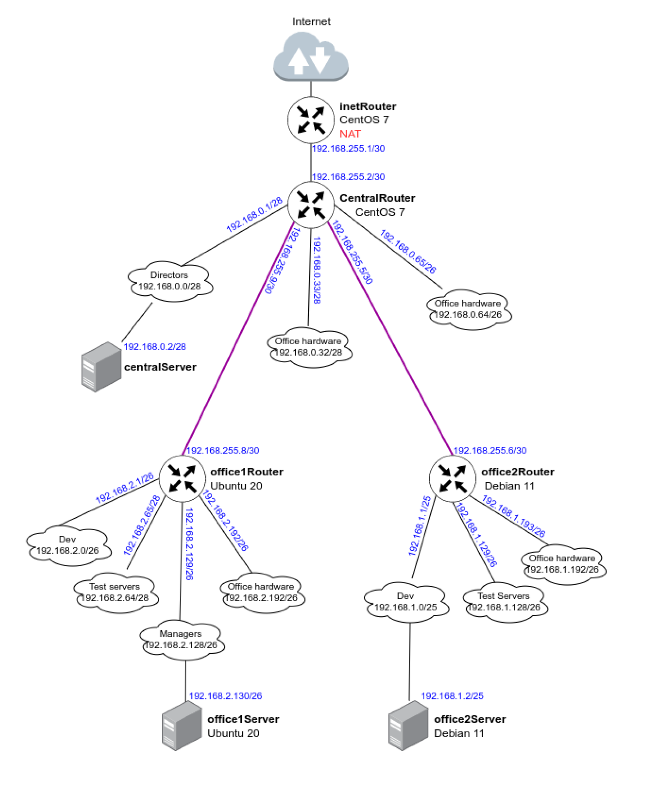

# **Homework 18**
Сетевая лаборатория

## Теоретическая часть
Свободные сети:
192.168.0.16/28
192.168.0.48/28
192.168.0.128/25
192.168.255.64/26
192.168.255.32/27
192.168.255.16/28
192.168.255.8/29
192.168.255.4/30

Ошибок при разбиении нет

Таблица сети (воспользуемся калькулятором https://ip-calculator.ru/)

Название сети - Сеть - Кол-во узлов - broadcast  
Central Network  
Directors - 192.168.0.0/28 - 14 - 192.168.0.15   
Office hardware - 192.168.0.32/28 - 14 - 192.168.0.47  
Wifi - 192.168.0.64/26 - 62 - 192.168.0.127  

Office 1 Network  
Dev - 192.168.2.0/26 - 62 - 192.168.2.63  
Test - 192.168.2.64/26 - 62 - 192.168.2.127  
Managers - 192.168.2.128/26 - 62 - 192.168.2.191  
Office hardware - 192.168.2.192/26 - 62 - 192.168.2.255  

Office 2 Network  
Dev - 192.168.1.0/25 - 126 - 192.168.1.127  
Test - 192.168.1.128/26 - 62 - 192.168.1.191  
Office - 192.168.1.192/26 - 62 - 192.168.1.255  

InetRouter — CentralRouter network
Inet—central - 192.168.255.0/30 - 2 - 192.168.255.3
Топология сети:

## Практическая часть
Скрипты ansible приложены
