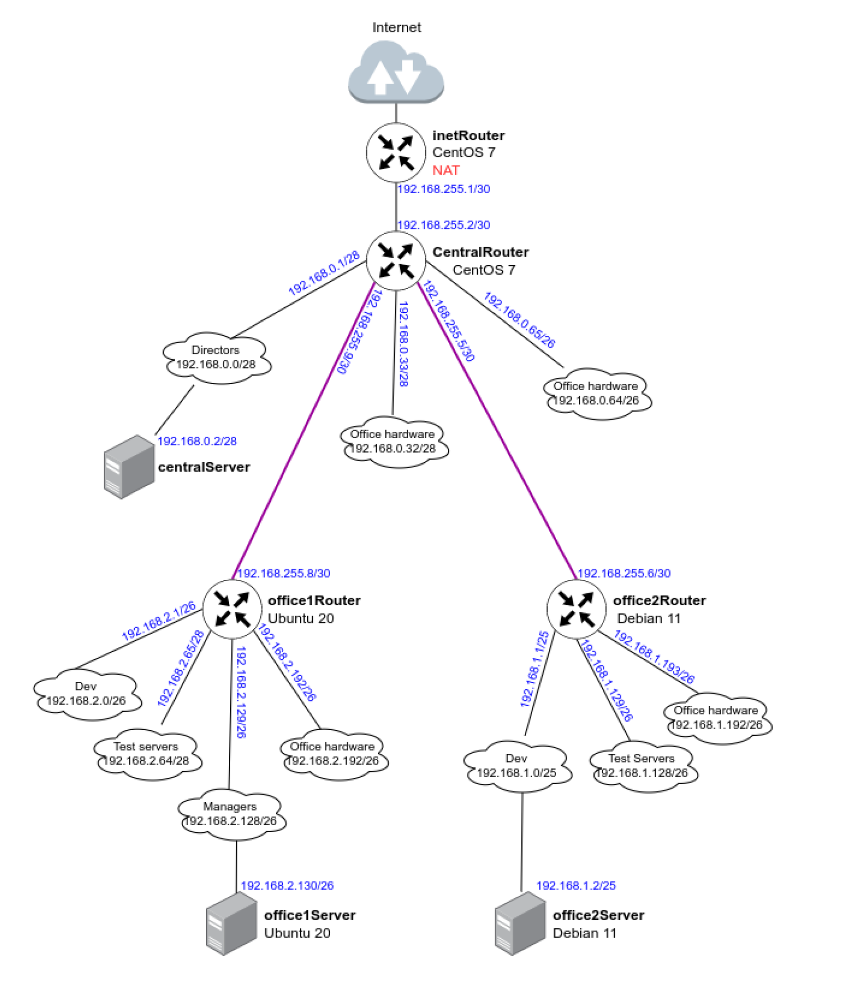

# **Homework 20**
Фильтрация трафика

Используем стенд из предыдущего ДЗ "Сетевая лаборатория"
Топология сети:


## Практическая часть
Скрипты ansible приложены

## Проверка knocking-порт
Зайдем на central-router и попробуем по ssh попасть на inet-router-1.
Затем попробуем тоже самое с помощью knocking port
```shell
vagrant ssh central-router
Last login: Sat Aug 27 10:50:21 2022 from 10.0.2.2
[vagrant@central-router ~]$ ssh test@192.168.0.6
ssh: connect to host 192.168.0.6 port 22: Connection refused
[vagrant@central-router ~]$ knock 192.168.0.6 2222:udp 3333:tcp 4444:udp
[vagrant@central-router ~]$ ssh test@192.168.0.6
The authenticity of host '192.168.0.6 (192.168.0.6)' can't be established.
ECDSA key fingerprint is SHA256:6rJhbpOeD0HY6M1E7pJg3OM8RCpUomEnvOWsvLQWnkA.
ECDSA key fingerprint is MD5:be:9e:81:17:ce:e1:ac:24:60:9e:7e:dd:ce:19:8f:22.
Are you sure you want to continue connecting (yes/no)? yes
Warning: Permanently added '192.168.0.6' (ECDSA) to the list of known hosts.
test@192.168.0.6's password: 
[test@inet-router-1 ~]$ 
```

## Проверяем, что сработал проброс порта 8080
```bash
$ curl http://localhost:8080
Hello World!
```

## Проверим, что трафик в интернет идет через inet-router-1
```bash
[vagrant@central-server ~]$ mtr 8.8.8.8
                                                                            Packets               Pings
 Host                                                                      Loss%   Snt   Last   Avg  Best  Wrst StDev
 1. 192.168.0.2                                                             0.0%    13    6.4   5.1   4.0   7.9   0.9
 2. 192.168.0.6                                                             0.0%    13    8.0   8.6   6.7  11.3   1.2
 3. ???
 4. ???
 5. ???
 6. 138.197.244.44                                                          0.0%    12   10.2  11.4   9.6  16.9   1.9
 7. 162.243.191.243                                                         0.0%    12    9.6  24.2   9.2 161.0  43.2
 8. 108.170.248.33                                                          0.0%    12   12.6  13.2  10.4  18.8   2.3
 9. 216.239.62.149                                                          0.0%    12   10.4  12.8  10.1  18.3   2.9
10. dns.google                                                              0.0%    12   12.5  14.0  10.2  27.4   4.6
```
