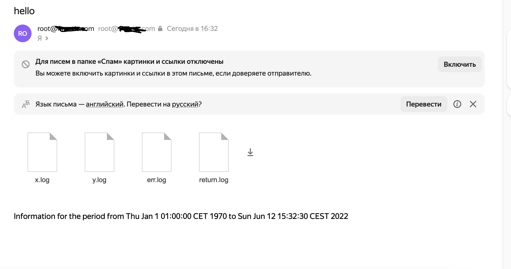

# **Homework 9**

Сначала подготовим команды по-отдельности, а затем объединим в скрипт
### **X IP адресов (с наибольшим кол-вом запросов) с указанием кол-ва запросов c момента последнего запуска скрипта**
```bash
    cat access-4560-644067.log | cut -f 1 -d ' ' | sort | uniq -c | sort -rn | head -n 10
```

### **Y запрашиваемых адресов (с наибольшим кол-вом запросов) с указанием кол-ва запросов c момента последнего запуска скрипта;**
```bash
    cat access-4560-644067.log | cut -f 7 -d ' ' | sort | uniq -c | sort -rn | head -n 10
```
### **все ошибки c момента последнего запуска**
```bash
  cat access-4560-644067.log | grep "HTTP\/1\.1\" [4-5].."
```

### **список всех кодов возврата с указанием их кол-ва с момента последнего запуска.**
```bash
     cat access-4560-644067.log | cut -f 9 -d ' ' | grep "[1-5].." | sort | uniq -c
```

Создадим скрипт /usr/local/bin/otus-log.sh
```bash
    cat <<-"EOF" > /usr/local/bin/otus-log.sh
#!/usr/bin/env bash

LOG_FILE=${1}
X=${2}
Y=${3}
LOG_POS_FILE="/tmp/log-otus.pos"

[[ ! -f "$LOG_FILE" ]] && exit 1

cat $LOG_FILE | cut -f 1 -d ' ' | sort | uniq -c | sort -rn | head -n $X > /tmp/x.log
cat $LOG_FILE | cut -f 7 -d ' ' | sort | uniq -c | sort -rn | head -n $Y > /tmp/y.log
cat $LOG_FILE | grep "HTTP\/1\.1\" [4-5].." > /tmp/err.log
cat $LOG_FILE | cut -f 9 -d ' ' | grep "[1-5].." | sort | uniq -c > /tmp/return.log

exit 0
EOF
```
Устанавливаем пермиссии на исполняемый файл
```
    chmod o+x /usr/local/bin/otus-log.sh
```
Выполняем, убеждаемся что нужные файлы создались
```
[root@oracle-linux ~]# bash /usr/local/bin/otus-log.sh access-4560-644067.log 10 10
[root@oracle-linux ~]# cd /tmp
[root@oracle-linux tmp]# ll
total 192
-rw-r--r--. 1 root root 165886 Jun 12 07:19 access-4560-644067.log
-rw-r--r--. 1 root root  12655 Jun 12 09:36 err.log
drwxr-xr-x. 3 root root     21 Jun 12 07:19 prospero
-rw-r--r--. 1 root root    108 Jun 12 09:36 return.log
drwx------. 3 root root     17 May  2 18:51 systemd-private-390abdd4550f41ea9386                  ccbdecfc3ef2-chronyd.service-eSX3Rz
-rw-r--r--. 1 root root    222 Jun 12 09:36 x.log
-rw-r--r--. 1 root root    265 Jun 12 09:36 y.log

```
Настраиваем отправку e-mail
```
    cat <<-"EOF" >> /etc/postfix/main.cf 
relayhost = xxx.xxx.xxx:25
smtp_sasl_auth_enable = no
smtp_use_tls = no
smtp_enforce_tls = no
smtp_sasl_security_options =
smtp_sasl_tls_security_options =
smtp_sasl_tls_verified_security_options =
EOF
```

Проверяем отправку письма с вложениями
```
    mail -s "hello" -a /tmp/x.log -a /tmp/y.log "admin@xxx.ru"<<EOF
hello
world
EOF
```
Готовим команду, котора будет преобразовывать время и дату из log файла в формат UNIX timestamp
```
    cat access.log | grep -E -o "[0-9]{2}\/[a-Z]*.*\+0300" | sed -e 's/\// /g'|sed -e 's/:/ /'|xargs -I mydate date -d "mydate" +%s
```
```
    [root@oracle-linux tmp]# cat access-4560-644067.log | grep -E -o "[0-9]{2}\/[a-Z]*.*\+0300" | sed -e 's/\// /g'|sed -e 's/:/ /'|xargs -I mydate date -d "mydate" +%s
1565745130
1565746715
1565746716
1565746717
1565747828
```
Добавляем функцию filter в наш скрипт
Также добавляем отправку письма
```bash
    cat <<-"EOF" > /usr/local/bin/otus-log.sh
#!/usr/bin/env bash

LOG_FILE=${1}
X=${2}
Y=${3}
LOG_POS_FILE="/tmp/log-otus.pos"
TMP_FILTERED_FILE="/tmp/log-otus-filtered"
X_FILE="/tmp/x.log"
Y_FILE="/tmp/y.log"
ERR_FILE="/tmp/err.log"
RETURN_FILE="/tmp/return.log"
MAIL_BODY_FILE="mail_body"

[[ -f "$LOG_POS_FILE" ]] && LAST_TS=$(cat "$LOG_POS_FILE") || LAST_TS=0

function filter {
  cat $LOG_FILE | grep -E -o "[0-9]{2}\/[a-Z]*.*\+0300" | sed -e 's/\// /g'|sed -e 's/:/ /'|xargs -I mydate date -d "mydate" +%s > /tmp/ts.log
  paste -d' ' /tmp/ts.log $LOG_FILE | sort | awk -v start_ts=$LAST_TS 'start_ts <= $1' | cut -d' ' -f2- > $TMP_FILTERED_FILE
}

[[ ! -f "$LOG_FILE" ]] && exit 1

filter

cat $TMP_FILTERED_FILE | cut -f 1 -d ' ' | sort | uniq -c | sort -rn | head -n $X > $X_FILE
cat $TMP_FILTERED_FILE | cut -f 7 -d ' ' | sort | uniq -c | sort -rn | head -n $Y > $Y_FILE
cat $TMP_FILTERED_FILE | grep "HTTP\/1\.1\" [4-5].." > $ERR_FILE
cat $TMP_FILTERED_FILE | cut -f 9 -d ' ' | grep "[1-5].." | sort | uniq -c > $RETURN_FILE

NOW_TS=$(date +%s)
NOW_FORMATTED=$(date)
LAST_TS_FORMATTED=$(date --date="@${LAST_TS}")
echo "Information for the period from ${LAST_TS_FORMATTED} to ${NOW_FORMATTED}" > $MAIL_BODY_FILE

mail -s "hello" -a $X_FILE -a $Y_FILE -a $ERR_FILE -a $RETURN_FILE "admin@oratorart.ru" < $MAIL_BODY_FILE

echo $NOW_TS  >"$LOG_POS_FILE"

exit 0
EOF
```
Вызываем, проверяем, что письмо пришло, необходимая инфа в теле письма присутствует:

Содержимое файла x.log:
```
     45 93.158.167.130
     39 109.236.252.130
     37 212.57.117.19
     33 188.43.241.106
     31 87.250.233.68
     24 62.75.198.172
     22 148.251.223.21
     20 185.6.8.9
     17 217.118.66.161
     16 95.165.18.146
```
Добавляем в log файл строку из будущего:
```
    echo '182.254.243.249 - - [15/Aug/2022:00:24:38 +0300] "GET /webdav/ HTTP/1.1" 404 3652 "-" "Mozilla/5.0"rt=0.222 uct="-" uht="-" urt="-"' >> access-4560-644067.log
```
Перезапускаем и видим, что фильтрация по интервалу сработала:
```
   1 182.254.243.249
```

Добавляем скриптик в crontab:
```
    crontab -e
```
```
    */5 * * * * /usr/local/bin/otus-log.sh
```
Добавляем trap для контроля мультизапуска - через lock-файл
```
    LOCKFILE=/tmp/otus_lockfile

    if [[ -f $LOCKFILE ]]; then
      echo "script is already locked!" >&2
      exit 1
    fi
    
    touch $LOCKFILE
    trap 'rm $LOCKFILE' EXIT
```

Итоговый скрипт:
```bash
    cat <<-"EOF" > /usr/local/bin/otus-log.sh
#!/usr/bin/env bash

LOCKFILE=/tmp/otus_lockfile

if [[ -f $LOCKFILE ]]; then
  echo "script is already locked!" >&2
  exit 1
fi

touch $LOCKFILE
trap 'rm $LOCKFILE' EXIT
    
LOG_FILE=${1}
X=${2}
Y=${3}
LOG_POS_FILE="/tmp/log-otus.pos"
TMP_FILTERED_FILE="/tmp/log-otus-filtered"
X_FILE="/tmp/x.log"
Y_FILE="/tmp/y.log"
ERR_FILE="/tmp/err.log"
RETURN_FILE="/tmp/return.log"
MAIL_BODY_FILE="mail_body"

[[ -f "$LOG_POS_FILE" ]] && LAST_TS=$(cat "$LOG_POS_FILE") || LAST_TS=0

function filter {
  cat $LOG_FILE | grep -E -o "[0-9]{2}\/[a-Z]*.*\+0300" | sed -e 's/\// /g'|sed -e 's/:/ /'|xargs -I mydate date -d "mydate" +%s > /tmp/ts.log
  paste -d' ' /tmp/ts.log $LOG_FILE | sort | awk -v start_ts=$LAST_TS 'start_ts <= $1' | cut -d' ' -f2- > $TMP_FILTERED_FILE
}

[[ ! -f "$LOG_FILE" ]] && exit 1

filter

cat $TMP_FILTERED_FILE | cut -f 1 -d ' ' | sort | uniq -c | sort -rn | head -n $X > $X_FILE
cat $TMP_FILTERED_FILE | cut -f 7 -d ' ' | sort | uniq -c | sort -rn | head -n $Y > $Y_FILE
cat $TMP_FILTERED_FILE | grep "HTTP\/1\.1\" [4-5].." > $ERR_FILE
cat $TMP_FILTERED_FILE | cut -f 9 -d ' ' | grep "[1-5].." | sort | uniq -c > $RETURN_FILE

NOW_TS=$(date +%s)
NOW_FORMATTED=$(date)
LAST_TS_FORMATTED=$(date --date="@${LAST_TS}")
echo "Information for the period from ${LAST_TS_FORMATTED} to ${NOW_FORMATTED}" > $MAIL_BODY_FILE

mail -s "hello" -a $X_FILE -a $Y_FILE -a $ERR_FILE -a $RETURN_FILE "admin@oratorart.ru" < $MAIL_BODY_FILE

echo $NOW_TS  >"$LOG_POS_FILE"

exit 0
EOF
```
